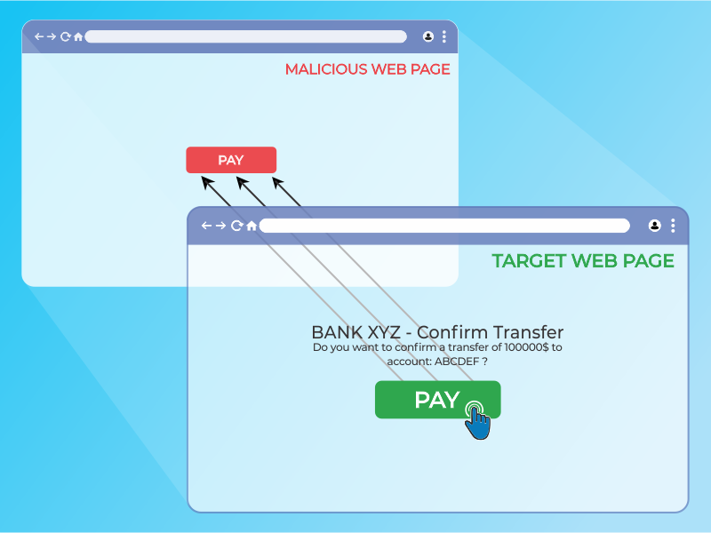
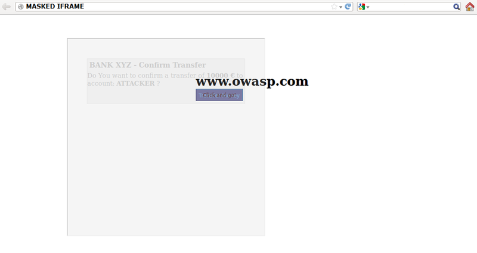

# Test Browser Security Controls

| ID           |
|--------------|
| WSTG-CONF-15 |

## Summary

Modern web browsers implement a wide array of security controls via HTTP response headers and cookie attributes. While many of these controls are now browser defaults or widely adopted by modern frameworks, their misconfiguration or explicit disabling can still expose applications to significant risks such as session hijacking, Cross-Site Scripting (XSS), and clickjacking.

Rather than treating each header as a separate checklist item, this section focuses on the desired security outcomes and the combination of controls required to achieve them.

## Test Objectives

- Validate that baseline transport and session security controls are enabled and correctly configured.
- Assess the effectiveness of framing and clickjacking protections.
- Evaluate the strength and enforcement of the Content Security Policy (CSP).
- Identify advanced header misconfigurations that could lead to security bypasses.

## How to Test

### Transport and Session Security Baseline

This baseline check ensures that the most fundamental browser-side protections are active.

#### HTTP Strict Transport Security (HSTS)

HSTS informs the browser that the site should only be accessed via HTTPS.

- **Verification**: Confirm the presence of the `Strict-Transport-Security` header.
- **Baseline Requirement**: `max-age` should be set to a significant value (e.g., at least six months / 15,768,000 seconds).
- **Enhanced Protection**: Use `includeSubDomains` and consider the `preload` list.
- **Note**: Ensure HSTS is delivered only over HTTPS; if sent over plain HTTP, it is ignored by the browser.
- **Interaction**: Review the interaction between HSTS and cookie scoping. If HSTS is only applied to the apex domain and cookies are set with a broad `Domain` attribute, cookies may still leak over HTTP to subdomains not covered by HSTS.

#### Cookie Security Attributes

Cookies must be locked down to prevent leakage and misuse.

- **Verification**: Inspect `Set-Cookie` headers for the following attributes:
    - `Secure`: Ensures cookies are only sent over HTTPS.
    - `HttpOnly`: Prevents access via client-side scripts (mitigating XSS impact).
    - `SameSite`: Prevents CSRF and cross-site leakage. (Note: Modern browsers default to `Lax` if omitted, but explicit configuration is preferred).
- **Advanced Controls**: Use `__Host-` and `__Secure-` prefixes to guarantee integrity and confidentiality of session tokens.
- **Strongest Pattern**: For session tokens, the recommended pattern is `Set-Cookie: __Host-SID=<token>; Path=/; Secure; HttpOnly; SameSite=Strict` (or `Lax` depending on the required user experience).
- **Cookie Types**: Distinguish between session cookies (which require maximum lockdown) and non-sensitive cookies (e.g., preferences, tracking), which may have different requirements.

### Framing and Clickjacking Prevention

Clickjacking (UI redressing) occurs when a target site is loaded in an invisible iframe, deceiving users into performing unintended actions.

\
*Figure 4.2.15-1: Clickjacking inline frame illustration*

#### Controls

- **X-Frame-Options (XFO)**: A legacy but still widely supported header. Valid values are `DENY` or `SAMEORIGIN`.
- **CSP `frame-ancestors`**: The modern replacement for XFO. It provides granular control over which origins can embed the page.
- **Defense in Depth**: Implement both XFO and CSP `frame-ancestors` to ensure coverage across both modern and legacy browsers.

#### Testing Methodology

- **Iframe Test**: Attempt to load the target page in a simple HTML `<iframe>`. If the page loads, it is potentially vulnerable.
- **Header Review**: Verify that either `X-Frame-Options` or CSP `frame-ancestors` is present and restrictive.
- **Bypass Check**: Test for "frame busting" JavaScript that can be bypassed by the `sandbox` attribute on the iframe.

\
*Figure 4.2.15-2: Masked inline frame illustration*

### Content Security Policy (CSP) and XSS Mitigation

CSP is a declarative allow-list that restricts the sources of resources loaded by the browser, serving as a primary defense against XSS.

#### Enforcement and Delivery

- **Verify Presence**: Check for the `Content-Security-Policy` header.
- **Report-Only Mode**: Identify if `Content-Security-Policy-Report-Only` is used. If only Report-Only is present, the policy is not enforced, and violations are only logged.
- **Delivery Method**: Prefer HTTP headers over `<meta>` tags. Note that `<meta>` tags do not support critical directives such as `frame-ancestors`, `report-uri`, `report-to`, or `sandbox`.
- **Consistency**: Confirm the policy is applied consistently across all sensitive endpoints.

#### High-Risk Directives and Common Bypasses

Inspect the policy for over-permissive directives that create bypasses:

- **`unsafe-inline` / `unsafe-eval`**: These significantly weaken XSS protections and should be avoided in high-risk applications.
- **Broad Wildcards**: Use of `*`, `https://*`, or broad CDN allow-lists (e.g., `*.cdn.com`) can allow loading of attacker-controlled scripts via JSONP endpoints or user-controlled content on those domains.
- **Missing Defaults**: Ensure `default-src` is restrictive. Explicitly set `object-src 'none'` and `base-uri 'none'` to prevent object injection and base tag manipulation.
- **Nonce and Hash Integrity**: If nonces are used, ensure they are cryptographically random and regenerated per response. Predictable or reused nonces allow bypass.
- **`strict-dynamic` Trust Chains**: Evaluate if `strict-dynamic` is used to propagate trust. Ensure no unsafe trust chains allow attacker-controlled script loading.
- **Trusted Types**: In modern applications, review the use of `require-trusted-types-for` and `trusted-types` to mitigate DOM-based injection sinks.

#### Validation and Testing

Testers should validate that the policy actually blocks unauthorized content rather than relying on the header's presence:

- **Controlled Bypasses**: Attempt to inject simple inline scripts, data-URL payloads, or JSONP callbacks from allow-listed domains.
- **Reporting Endpoints**: Verify that `report-uri` or `report-to` endpoints are reachable and functional, and ensure they do not leak sensitive information or introduce DoS vectors.

#### Policy Strength Criteria

A robust CSP typically:

- Avoids `unsafe-inline` and `unsafe-eval`.
- Uses nonce- or hash-based script controls.
- Restricts object embedding (`object-src 'none'`) and base tag manipulation (`base-uri 'none'`).
- Restricts framing using `frame-ancestors`.

### Advanced Header Misconfigurations

Some security failures result from how headers are processed by proxies or the browser's parsing logic.

#### Hop-by-Hop Header Injection

Attackers may attempt to "strip" sensitive internal headers (like `X-Forwarded-For` or `X-Authenticated-User`) by adding them to the `Connection` header.

- **Test**: Add a known internal header to the `Connection` header and observe if the application behavior changes.

#### Header Integrity and Modern Controls

- **Duplicate Headers**: Check for multiple occurrences of the same security header with conflicting values, which can lead to unpredictable browser behavior or complete disabling of the protection.
- **Typos and Invalid Values**: Ensure headers are named correctly and use valid directives. A misspelling (e.g., `X-Frame-Option` instead of `X-Frame-Options`) renders the protection ineffective.
- **Modern Controls**: Evaluate the implementation of other high-impact headers:
    - `X-Content-Type-Options: nosniff`: Prevents MIME-type sniffing.
    - `Referrer-Policy`: Ensure values are not overly permissive (e.g., avoid `unsafe-url`).
    - `Permissions-Policy`: Review feature policy restrictions.
    - **Cross-Origin Isolation**: Review COOP, COEP, and CORP headers for applications requiring a secure execution environment.
    - `Clear-Site-Data`: Ensure this is used on logout to clear cookies, storage, and cache.
- **Deprecated Headers**: Identify and remove obsolete headers such as `X-XSS-Protection`, `Expect-CT`, or `HPKP`, which are no longer supported by modern browsers and can be misleading.

## Remediation

- **Implement a "Secure by Default" Header Set**: Use a standardized set of headers (HSTS, CSP, X-Content-Type-Options, etc.) across all endpoints.
- **Shift to CSP `frame-ancestors`**: Replace or augment `X-Frame-Options` with CSP for better granularity.
- **Strict CSP Policies**: Move toward nonce-based or hash-based CSPs and avoid `unsafe-inline`.
- **Hardened Cookies**: Always use `Secure`, `HttpOnly`, and an explicit `SameSite` attribute.

## References

- [OWASP Secure Headers Project](https://owasp.org/www-project-secure-headers/)
- [Mozilla Developer Network: HTTP Security Headers](https://developer.mozilla.org/en-US/docs/Web/HTTP/Headers)
- [RFC 6797 - HSTS](https://datatracker.ietf.org/doc/html/rfc6797)
- [Clickjacking Defense Cheat Sheet](https://cheatsheetseries.owasp.org/cheatsheets/Clickjacking_Defense_Cheat_Sheet.html)
